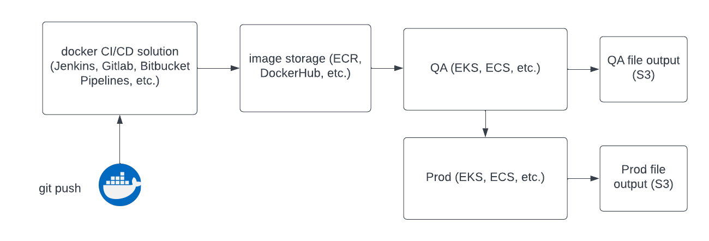

### Questions and Assumptions

*What do we do when no location info is available for a tweet?*  
My assumption here is that we ignore these tweets completely and move on.

*Is it ever ok to query the Weather API on place name or pull in Twitter v1 API location info?*  
My assumption is that it is not and also not necessary, and I have stuck to using only the centroid of the bbox provided by Twitter API v2 as  this is readily available for all locations.

*When are a Twitter location and Weather API location "close enough"?*  
I have assumed that the lat/lon from bbox centroid will be taken as gospel here. I have added logging for place names from both APIs for checking and out of personal curiosity.

*What should happen on failure?*  
I have assumed that on failure, we would restart and just begin a new rolling calculation with new data. Trying to pick up prior vals on existing files would add a lot of complexity that I assume is not really what you are wanting for this ask.

*How much logging, error handling, documentation, and testing would you like to see here?*  
I have assumed perhaps a minimal amount to show familiarity and best practice, I'm sure there is much more work that could be done on this. I have tried to avoid overkill.

### Directions to run

1) Please clone the repo to your local machine.


2) Please create a file called `.env` in the root directory of the repo. The file `.env.template` has been provided as an example. Here you will add the following environment variables that will be utilized by Docker compose:
```angular2html
TWITTER_TOKEN=<YOUR_TWITTER_API_TOKEN>
WEATHER_TOKEN=<YOUR_WEATHER_API_TOKEN>
ROLL_VAL=<integer N of temps to calc rolling avg>
```

3) Please make sure [Docker](https://docs.docker.com/get-docker/) is installed and running on your local machine.  


4) In the terminal, navigate to the root directory of the repo. All other commands should be run from this location. Now, please build the image:

```angular2html
docker-compose build
```
5) Now please run the image:

```angular2html
docker-compose up
```
6) The running container will create a folder in your home directory called `output/` that will contain process output files. On Mac, this should be your username directory (of course).


7) To end it all, hit `ctr+C` in the terminal or use `docker ps` to locate the container ID and use `docker stop <container ID>`.


### Production Deployment



A production deployment should follow modern CI/CD deployment standards.
1. Local push to a build server. 
2. Push to an image hub if build is "OK".
3. Automated deployment to QA env for testing.
4. Promotion to Prod env for final deployment upon approval.

Mostly AWS options are mentioned in diagram above, though there are many similar ways to produce this setup. Note that app will need to be refactored to output to S3 if AWS is the cloud provider used.


### Miscellaneous

Here are some other useful docker commands I like to keep around in READMEs for reference and easy access:

```
# rebuild no cache
docker build --no-cache -t kirks-bh-tweet-app:latest .

# shell into running container by name
docker exec -it $(docker ps -q --filter ancestor=kirks-bh-tweet-app:latest) /bin/bash

# stop running container by name
docker stop $(docker ps -q --filter ancestor=kirks-bh-tweet-app:latest)

# clean up docker
docker system prune -f
```